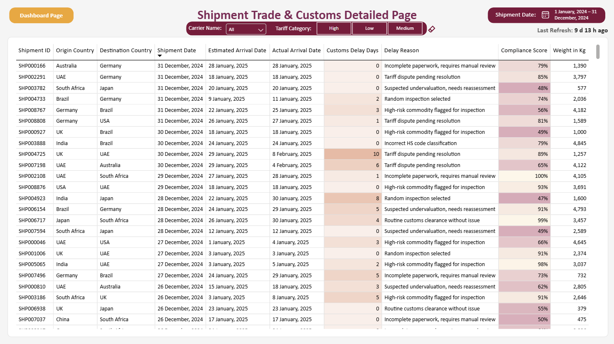

I’m a Power BI Developer with nearly **3** years of experience designing dashboards and data models in **Power BI** and **SQL Server**. I specialize in transforming raw ERP/SAP data into actionable insights for Finance, Supply Chain, and Procurement teams.

#### Skills
`SQL` | `Power BI` | `Python` | `SAP HANA` | `SQL Server` | `Data Modeling` | `ETL` | `Machine Learning` | `Power Query` | `Dashboard Development`

---

# Experience

## Power BI Developer | National Planning Council

Developed interactive dashboards and automated pipelines that centralized legacy reporting, enabling secure, data-driven leadership decisions across departments using **Power BI, Power Automate, and SharePoint**.

### Key Achievements
<!--- Developed **20+** interactive Power BI dashboards, increasing visibility on key national indicators by 60% and enabling faster, data-driven decision-making across departments
- Partnered with domain experts and business stakeholders to design **KPI-focused** dashboards that support accurate reporting to senior leadership
- Transformed fragmented Excel-based monitoring processes into centralized, user-friendly BI solutions, significantly **reducing manual validation** effort
- Configured and maintained an *on-premise data gateway* on a virtual machine to enable secure and reliable scheduled refreshes from on-premise SharePoint sources
- Resolved connectivity and refresh issues by installing and **validating SSL certificates** on the gateway environment, ensuring successful data refresh operations in Power BI Service
- Improved report adoption through intuitive navigation, filtering, and drill-through capabilities, **enhancing usability** for non-technical users
- Recognized as **Employee of the Month** (May 2026) by the Information Systems Department for outstanding contributions and performance
- Automated manual data extraction from Microsoft Entra ID to SharePoint Excel using Power Automate flow with **incremental refresh** mechanism-->
- Developed 20+ interactive dashboards that boosted national indicator visibility by 60% and accelerated cross-departmental decision-making.
- Collaborated with business stakeholders to design KPI-focused layouts for accurate senior leadership reporting.
- Converted fragmented Excel tracking into automated BI environments, drastically eliminating manual data validation.
- Built user-friendly navigation and drill-through functions to optimize system usability for non-technical users.
- Named Employee of the Month (May 2026) within the Information Systems Department for exceptional performance.
- Maintained an incremental refresh pipeline using Power Automate to seamlessly extract Microsoft Entra ID logs.
- Configured and managed an On-Premises Data Gateway on a virtual machine to bridge localized SharePoint assets.
- Resolved active refresh failures in the Power BI Service by installing and validating gateway SSL certificates.

## Data & Reporting Specialist | Baladna Food Industries

Designed and optimized enterprise reporting solutions and data pipelines for Finance and Supply Chain operations using **SAP HANA, SQL Server, and Power BI**.

### Key Achievements
- Migrated financial dashboards from **SAP Analytics Cloud (SAC) to Power BI**
- Built automated procurement and supplier tracking systems
- Engineered SAP HANA → SQL Server incremental loading pipelines
- Developed executive dashboards and KPI monitoring solutions
- Improved reporting efficiency, refresh speed, and business visibility

---

# Education

- **BSc in Computer Engineering** | Qatar University (_May 2023_)
- **Data Science Specialization** | ZAKA AI Certification (_Nov 2022_)

---

# Projects

## <ins>Dox - The Data Professional's Guide</ins>

A professional data chatbot that aims in reminding and helping data experts in certain concepts in a simplified way while also having access to download DataCamp's public cheat sheets on many data-related topics.

### Technologies
- OpenAI
- LlamaIndex
- Agno
- Hugging Face
- Python
- Vector Embeddings
- RAG Architecture

🔗 [Live Demo](https://huggingface.co/spaces/Crackershoot/BuildingAIChallenge)

---

## <ins>HelenForTheHired — AI HR Professional Chatbot</ins>

An AI-powered HR chatbot developed using **Pinecone, LlamaIndex, OpenAI LLMs, Python, Hugging Face, and Retrieval-Augmented Generation (RAG)** to answer employee HR-related questions intelligently.

### Technologies
- OpenAI
- LlamaIndex
- Pinecone
- Hugging Face
- Python
- Vector Embeddings
- RAG Architecture

🔗 [Live Demo](https://huggingface.co/spaces/Crackershoot/AIAcceleratorBootcamp)

---

## <ins>Migration of SAC Financial Dashboard → Microsoft Power BI</ins>


Enhanced financial reporting performance by **30%** through migrating **9 enterprise financial dashboards from SAP Analytics Cloud (SAC) to Microsoft Power BI**.

### Dashboards
<!--
- [Accounts Payable (AP)](/assets/pbi/Accounts%20Payable.pbix)  
  

- [Accounts Receivable (AR)](/assets/pbi/Accounts%20Receivable.pbix)  
  

- [Balance Sheet](/assets/pbi/Balance%20Sheet.pbix)
-->
- Balance Sheet
  
- Shipment Trade & Customs Dashboard
- 
- 

<!--
- [Detailed P&L](/assets/pbi/Detailed%20P&L.pbix)  
  

- [Executive Summary](/assets/pbi/Executive%20Summary.pbix)  
  

- [KPI Analysis I](/assets/pbi/KPI%20Analysis%20I.pbix)  
  

- [KPI Analysis II](/assets/pbi/KPI%20Analysis%20II.pbix)  
  

- [KPI Bridges](/assets/pbi/KPI%20Bridges.pbix)  
  

- [Treasury](/assets/pbi/Treasury.pbix)  
   
-->

### Technologies
- Power BI
- SAP HANA
- SQL
- DAX
- Power Query

---

## <ins>Automated Supplier Tracking & P2P Analytics System</ins>


Developed a dynamic enterprise Power BI reporting solution covering the entire **Procure-to-Pay (P2P)** cycle:

**Purchase Request (PR) → Purchase Order (PO) → Goods Receipt (GRN) → Invoice → Bank Reconciliation Statement (BRS)**

### Business Impact
- Reduced manual tracking effort by **40%**
- Enabled real-time monitoring for:
  - Procurement
  - Accounts Payable
  - Treasury
- Improved supplier payment visibility and operational efficiency

### Technologies
- Power BI
- SAP HANA
- SQL
- DAX
- ETL Pipelines

---

## <ins>SAP HANA → SQL Server Incremental Load Pipeline</ins>


Engineered a linked-server integration between **SAP HANA** and **Microsoft SQL Server** to automate incremental sales data loading and optimize reporting refresh performance.

### Business Impact
- Improved ETL efficiency by **60%**
- Reduced refresh times
- Enabled faster reporting availability and decision-making

### Sample Query

```sql
SELECT *
FROM OPENQUERY(LINKED_SERVER_NAME,
  'SELECT * FROM SERVER.SCHEMA.SALES_DATA')
```

### Technologies
- SAP HANA
- SQL Server
- OPENQUERY
- Incremental Loading
- Stored Procedures
- ETL Optimization

---

## <ins>Arabic Cyberbullying Detection using AraBERT</ins>

Built an NLP classification model using **AraBERT** to detect cyberbullying in Arabic tweets.

### Technologies
- Python
- AraBERT
- NLP
- Deep Learning
- Transformers
- Hugging Face

---

## <ins>Arabic News Clustering System</ins>

Developed an Arabic NLP system capable of clustering and categorizing Arabic news articles automatically using machine learning techniques.

### Technologies
- Python
- NLP
- Text Clustering
- Machine Learning

---

## <ins>AI Advisory System</ins>

Developed an AI-based advisory platform that provides intelligent recommendations and decision-support insights using machine learning techniques.

### Technologies
- Python
- Machine Learning
- Data Analytics

---

# Certifications

- **Microsoft Certified:** Fabric Analyst Engineer Associate (2026 - 2027) 
- **Microsoft Certified:** Power BI Data Analyst Associate (2025 - 2027)
- **OCI Foundations Associate:** AI (2025 - 2027)
- **OCI Professional:** Generative AI (2024 - 2026)
- **Chief AI Officer (CAIO)** — Decoding Data Science (2026)
- **ZAKA AI Certification:** Data Science Specialization (2022)

---

# Awards & Achievements

- 🥇 **1st Place — Microsoft Qatar Imagine Cup 2022**
- 🏆 **QCRI Internship Project Award**
- 💻 **ICPC Competitive Programming Participant**
- 🌍 **Huawei ICT Competition Participant**
- 🤖 **ZAKA AI Hackathon Participant**

---

# Publications

- [Building Dox: An 8 Day Journey to an AI Data Professional’s Guide](https://academy.decodingdatascience.com/blog/buildingdoxchallenge)
- [How to Integrate ChatGPT with Power Query?](https://www.linkedin.com/pulse/how-integrate-chatgpt-power-query-azzam-alnatsheh-hpbye/?trackingId=9syrsDqUMFelrHyGu7K%2BNg%3D%3D)
- [Blockchain and its Potential in the Digitization of Land and Real Estate Property Records](https://qspace.qu.edu.qa/handle/10576/46815)

---

# Socials

- [LinkedIn](https://www.linkedin.com/in/azzamalnatsheh/)
- [Portfolio](https://azzamalnatsheh.github.io/)
- [GitHub](https://github.com/AzzamAlnatsheh)
- [Hugging Face](https://huggingface.co/Crackershoot)

📧 Email: azzam-2222@live.com
